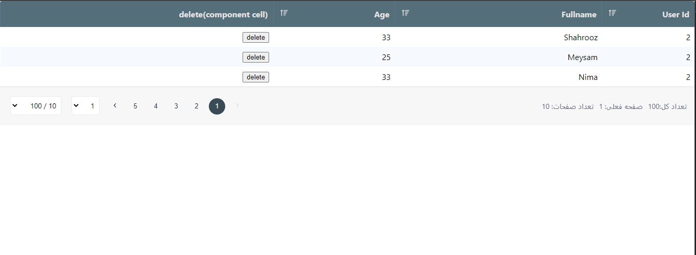

# react-angrid


react-angrid is a free and light component in react for data grid with supporting:

  - type script
  - paging 
  - sortable
  - rtl
  - other language



## Installation

react-angrid requires react "^18.2.0", react-dome "^18.2.0" to run.
```
npm i react-angrid --save
```
### Usage
Minimal Usage:

```
import {Angrid} from "rect-angrid";
...
  const columns = [
    {
      field: "fullname",
      headerName: "First & last Name",
      description: "name of user",
      width: 50,
    },
    {
      field: "age",
      headerName: "Age",
      description: "age of user",
      width: 50,
    },
    .
    .
    .
    ];
    const rows = [
    {
      key:"1",
      fullname:"shahrooz bazrafshan"
    },
    {
        
    }
    ];
      <AnGrid
        columns={columns}
        rows={rows}
        showRowNumber={true}
        disabledPaging={true}
      />
...
```
Advanced Usage:
```
    import {Angrid} from "rect-angrid";

    const columns = [
    {
      field: "fullname",
      headerName: "First & last Name",
      description: "name of user",
      width: 50,
    },
    {
      field: "age",
      headerName: "Age",
      description: "age of user",
      width: 50,
      renderCell:(info)=><strong>Age is : {info.data.age}</strong>
    },
    .
    .
    .
    ];
    ...
    //some required states
    const [loading, setLoading] = useState(false);
    const [rows, setRows] = useState([]);
    const [filter, setFilter] = useState({
        pageSize: 4,
        pageNumber: 1,
    });
    const [totalCount, setTotalCount] = useState(3);
  
    let active = true;
    const _delete = (data) => {
    setRows(rows.filter(x => x.userId !== data.userId))
  }
  
    const _fetchData = async () => {
    console.log('=== fetch data');
    if (!active) return;
    //mock api, you can call your api then set data to table like commented line below
    return new Promise((resolve) => {
      setLoading(true);
      setTimeout(() => {
          setRows(data);// SetRows, note that data comes from api and must be array of objects
        setTotalCount(7);//=== set total page size for pagination part
        resolve();
        setLoading(false);
      }, 2000);
    });
  }

  useEffect(() => {
    _fetchData();
    return () => {
      active = false;
    }
  }, [filter]);
    ...
      <AnGrid
        loading={loading}
        columns={columns}
        rows={rows}
        pageSize={filter.pageSize}
        pageNumber={filter.pageNumber}
        totalCount={totalCount}
        onPageChange={_handlePageChange}
        theme="dark"
        minHeight={300}
        emptyList={<strong>There Is No Info</strong>}
      />

```
#### Props
- **columns:** must be array of object like:
 ```
    [{
      field: ,//name of property that in data must be shown(string)
      headerName: ,the string that shows in header.(string)
      description: ,//tooltip string
      width: ,//column width(int),
      sortable:,//indicate that by clicking on culmn it can b sorted or not(bool)
      renderCell:(rowInfo)=>{return xxx;}//an optional function that returns a component for each cell, it recieve an object that conatins row data,if this be defined, then the return component of it be shown in each column cell,
      cellClass:an optional function that recieve data and returns a class object to be set on each row cells
    },
    .
    .
    .
    ]
```
- **rows:** must be array of object that contains field property to be shown, and each row must ahve a unique key
- **loading:** toggle loader overlay when fetching data
- **showRowNumber:** if true append a row number as first column(bool,default is false)
- **pageSize:** the page size of data, you can set it after api fetch(int)
- **pageNumber:** the page Size of data,you can set it after api fetch(int)
- **totalCount:** total count of data rows,you can set it after api fetch(int)
- **onPageChange:** this is a function that triggers after changeing a page number in component and gives it new page number as parameter,you can use to call api and set new data
- **strings:** an object of used strings that can be change in other languages:
```
{
  notFound:'There Is No Data',
  indexTitle:'Row Number',
  pageNumber:'Page Number'
}
```
- **emptyList:** a component that renred if rows length is zero
- **minHeight:** minimum height of component(int, default 300px)
- **theme:** theme for component(string,default is dark)
- **customPagination:** if exist, the component show up instead od default pagination
 
##### Todos

 - Add Responsive configuration
 - Add More Theme

